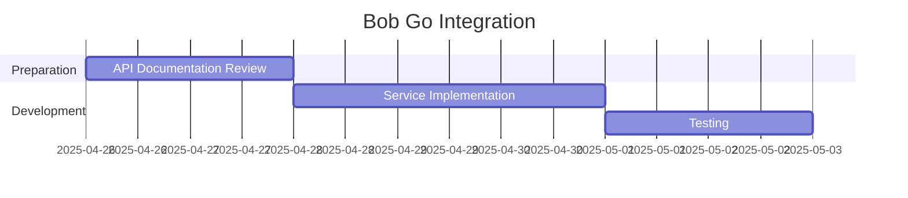

# Bob Go Integration Plan - Session Notes

## Current Status
- [x] Direct purchase flow implemented
- [x] Purchase page created
- [ ] Bob Go API access requested (email sent)

## Next Steps
1. **API Integration**:
   - Create `bobGoService.js` when credentials received
   - Implement:
     - Rate calculation
     - Order creation
     - Tracking

2. **Firestore Updates**:
   - Add delivery status tracking
   - Store Bob Go reference IDs

3. **Testing Plan**:
   - Mock API responses
   - Test local delivery flow
   - Verify tracking updates

## Timeline

## Open Questions
- Pricing structure
- Rate limits
- Webhook requirements
